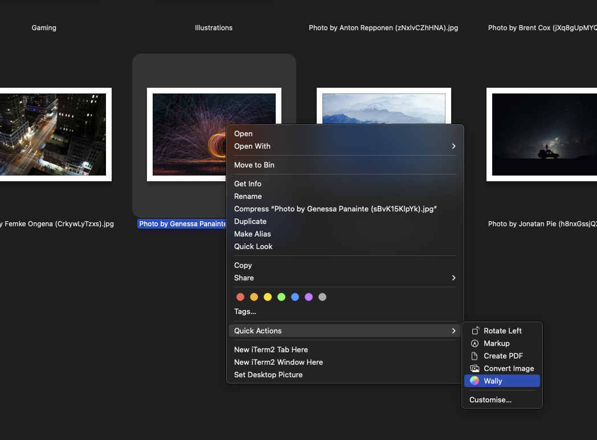

### Description:  
There is no easy way to apply wallpaper to every virtual desktop.  
This utility takes care of that.  
  
### Usage:  
Download binary from [releases](https://github.com/georgesofianosgr/wally/releases), place it to "/usr/local/bin" and run:  
```wally "/path/to/image.jpg"```  
You can also use MacOS quick actions to apply wallpaper from context menu (check releases notes)  
  
### WARNING  
**This utility is still expirimental** and  
it updates the local sqlite db file  "~/Library/Application Support/Dock/desktoppicture.db"  
In case something goes wrong delete this file and MacOS will recreate it.  
  
Code based on [pywal wallpaper update](https://github.com/dylanaraps/pywal/blob/master/pywal/wallpaper.py#L139).
